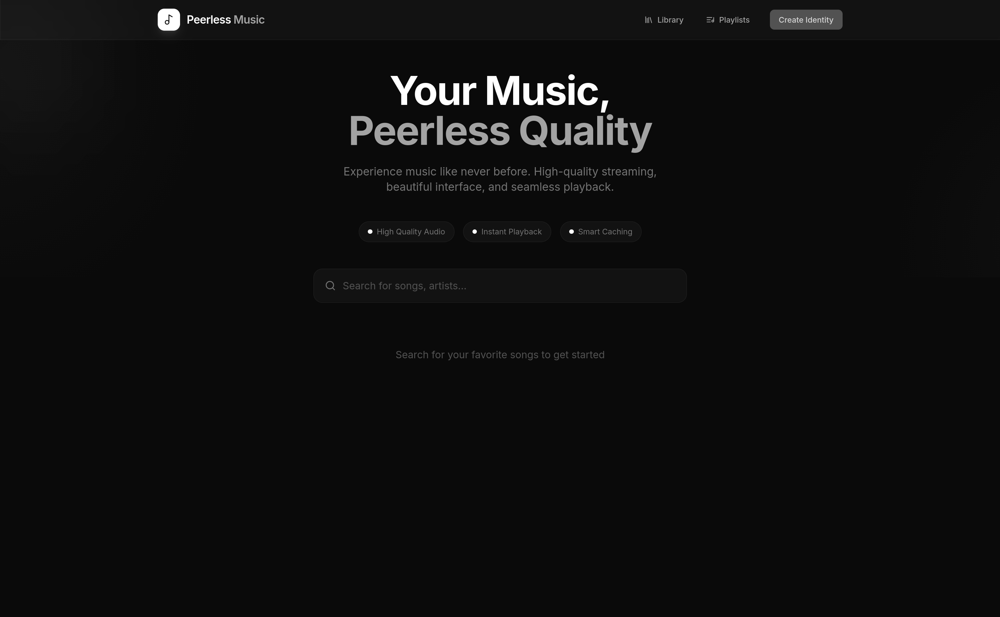

# Peerless Music



A production-ready music streaming web application inspired by Apple Music's design, featuring smooth animations, high-quality audio streaming, and smart caching via Cloudinary.

## Features

- Apple Music-inspired UI with glassmorphism effects
- Smooth page transitions and hover animations using Framer Motion
- Cursor-based color theme interaction with gradient glow effects
- Debounced search with real-time autocomplete suggestions
- High-quality audio streaming (320kbps)
- Smart caching system via Cloudinary
- **Universal Playlists** - Playlists work anonymously and can be assigned to an identity later
- **Auto-play** - Next track plays automatically when current song ends
- **Custom Identity System** - Anonymous or persistent identities with username/password
- **Responsive Design** - Fully optimized for mobile, tablet, and desktop
- **Media Session API** - Native media controls integration
- **Smart Caching** - Audio is processed once and delivered via Cloudinary CDN

## Tech Stack

### Frontend
- **React 18** with TypeScript
- **Vite** for fast development and building
- **Tailwind CSS** for styling
- **Framer Motion** for animations
- **Radix UI** for accessible UI primitives
- **Zustand** for state management
- **Lucide React** for icons

### Backend
- **FastAPI** (Python)
- **yt-dlp** for audio extraction
- **FFmpeg** for audio preprocessing
- **Cloudinary** for storage and delivery

## Project Structure

```
music-app/
├── frontend/                    # React frontend application
│   ├── public/
│   │   └── favicon.svg         # Application favicon
│   ├── src/
│   │   ├── components/
│   │   │   ├── CursorGlow.tsx  # Cursor-following gradient glow effect
│   │   │   ├── Header.tsx      # Navigation header with logo
│   │   │   ├── HeroSection.tsx # Landing hero with animated gradients
│   │   │   ├── LoadingOverlay.tsx # Full-screen loading indicator
│   │   │   ├── Player.tsx      # Music player (mini and expanded views)
│   │   │   ├── RecentTracks.tsx # Recently played tracks grid
│   │   │   ├── SearchBar.tsx   # Debounced search with autocomplete
│   │   │   ├── Toast.tsx       # Notification toast component
│   │   │   └── TrackCard.tsx   # Individual track display card
│   │   ├── hooks/
│   │   │   ├── useAudio.ts     # Audio playback management hook
│   │   │   └── useDebounce.ts  # Generic debounce hook
│   │   ├── store/
│   │   │   └── playerStore.ts  # Zustand store for player state
│   │   ├── styles/
│   │   │   └── index.css       # Global styles and Tailwind config
│   │   ├── types/
│   │   │   └── index.ts        # TypeScript type definitions
│   │   ├── utils/
│   │   │   ├── api.ts          # API client functions
│   │   │   ├── cn.ts           # Class name utility (clsx + tailwind-merge)
│   │   │   └── format.ts       # Formatting utilities (duration, title)
│   │   ├── App.tsx             # Main application component
│   │   └── main.tsx            # Application entry point
│   ├── index.html              # HTML template
│   ├── package.json            # Frontend dependencies
│   ├── postcss.config.js       # PostCSS configuration
│   ├── tailwind.config.js      # Tailwind CSS configuration
│   ├── tsconfig.json           # TypeScript configuration
│   ├── tsconfig.node.json      # TypeScript config for Node
│   └── vite.config.ts          # Vite configuration with proxy
│
├── backend/                     # FastAPI backend application
│   ├── main.py                 # FastAPI app with all endpoints
│   ├── config.py               # Environment configuration loader
│   ├── models.py               # Pydantic data models
│   ├── cloudinary_service.py   # Cloudinary upload/check functions
│   ├── youtube_service.py      # YouTube search and download logic
│   └── requirements.txt        # Python dependencies
│
├── .env.example                 # Environment variables template
└── README.md                    # This documentation file
```

## File Descriptions

### Frontend Components

| File | Purpose |
|------|---------|
| `CursorGlow.tsx` | Creates a subtle gradient glow that follows the mouse cursor using Framer Motion springs for smooth tracking |
| `Header.tsx` | Fixed navigation header with animated logo and nav links |
| `HeroSection.tsx` | Landing section with animated background gradients and feature badges |
| `LoadingOverlay.tsx` | Full-screen overlay shown while tracks are being processed |
| `Player.tsx` | Complete music player with mini (bottom bar) and expanded (modal) views, including seek bar, volume control, and playback controls |
| `RecentTracks.tsx` | Grid display of recently played tracks with animated entry |
| `SearchBar.tsx` | Search input with debounced API calls, keyboard navigation, and thumbnail previews in dropdown |
| `Toast.tsx` | Notification system for success, error, and info messages |
| `TrackCard.tsx` | Card component displaying track thumbnail, title, artist, and duration with hover animations |
| `PlaylistsPanel.tsx` | Slide-out panel for managing user playlists with create/edit/delete functionality |
| `AddToPlaylistButton.tsx` | Dropdown button to add tracks to playlists from search results or track cards |

### Frontend Hooks

| File | Purpose |
|------|---------|
| `useAudio.ts` | Manages HTML5 Audio element lifecycle, handles play/pause, time updates, seeking, and auto-play next track |
| `useDebounce.ts` | Generic debounce hook that delays value updates until user stops typing |

### Frontend Store

| File | Purpose |
|------|---------|
| `playerStore.ts` | Zustand store managing current track, playback state, volume, progress, and queue |
| `playlistStore.ts` | Zustand store for user playlists with persistence, CRUD operations, and auto-play navigation |
| `authStore.ts` | Authentication store prepared for Clerk integration with demo mode for testing |

### Frontend Utils

| File | Purpose |
|------|---------|
| `api.ts` | API client with functions for search, stream, and cache check endpoints |
| `cn.ts` | Utility combining clsx and tailwind-merge for conditional class names |
| `format.ts` | Duration formatting (seconds to mm:ss) and title truncation |

### Backend Files

| File | Purpose |
|------|---------|
| `main.py` | FastAPI application defining all REST endpoints (/search, /stream, /check) with CORS middleware |
| `config.py` | Loads environment variables from .env file for Cloudinary credentials and port |
| `models.py` | Pydantic models for type-safe request/response handling |
| `cloudinary_service.py` | Functions to check if audio exists, upload audio files, and upload thumbnails to Cloudinary |
| `youtube_service.py` | YouTube search, audio download with yt-dlp, and audio normalization with FFmpeg |

## Music Fetching Logic

The application follows a smart caching strategy to minimize redundant downloads:

```
1. User searches for a song
       ↓
2. Backend receives stream request
       ↓
3. Generate unique track_id from title + artist
       ↓
4. Check Cloudinary for existing audio
       ↓
   ┌───┴───┐
   ↓       ↓
EXISTS   NOT FOUND
   ↓       ↓
   ↓    5. Search YouTube for video
   ↓       ↓
   ↓    6. Download best audio (yt-dlp)
   ↓       ↓
   ↓    7. Normalize audio (FFmpeg)
   ↓       - Loudness normalization (I=-16)
   ↓       - 48kHz sample rate
   ↓       - 320kbps bitrate
   ↓       ↓
   ↓    8. Upload to Cloudinary
   ↓       - Audio → peerless_music/audio/{track_id}
   ↓       - Thumbnail → peerless_music/thumbnails/{track_id}
   ↓       ↓
   └───┬───┘
       ↓
9. Return stream URL to frontend
       ↓
10. Frontend plays audio via HTML5 Audio
```

## Cloudinary Flow

### Storage Structure
```
peerless_music/
├── audio/
│   ├── {track_id_1}.mp3
│   ├── {track_id_2}.mp3
│   └── ...
└── thumbnails/
    ├── {track_id_1}.jpg
    ├── {track_id_2}.jpg
    └── ...
```

### Track ID Generation
Track IDs are generated by:
1. Combining title and artist: `{title}_{artist}`
2. Converting to lowercase and stripping whitespace
3. Computing MD5 hash and taking first 16 characters

This ensures the same song always maps to the same ID, preventing duplicates.

### Cloudinary Operations
1. **Check**: Query Cloudinary API for resource existence
2. **Upload Audio**: Upload as "video" resource type (supports audio), convert to MP3
3. **Upload Thumbnail**: Upload with automatic transformation (500x500, crop fill)

## Search Debouncing

The search implements frontend debouncing to prevent excessive API calls:

```typescript
// useDebounce hook delays value updates
const debouncedQuery = useDebounce(query, 400)

// API call only fires when debounced value changes
useEffect(() => {
  if (debouncedQuery) {
    searchTracks(debouncedQuery)
  }
}, [debouncedQuery])
```

**Flow:**
1. User types "hello"
2. Each keystroke updates `query` immediately
3. `debouncedQuery` waits 400ms after last keystroke
4. API call fires only once with "hello"
5. No intermediate calls for "h", "he", "hel", "hell"

## Environment Configuration

Create a `.env` file in the project root (copy from `.env.example`):

```env
CLOUDINARY_CLOUD_NAME=your_cloud_name
CLOUDINARY_API_KEY=your_api_key
CLOUDINARY_API_SECRET=your_api_secret
BACKEND_PORT=8000

# JWT Secret for Identity System
JWT_SECRET=your_secret_key
```

### Getting Cloudinary Credentials
1. Sign up at [cloudinary.com](https://cloudinary.com)
2. Navigate to Dashboard
3. Copy Cloud Name, API Key, and API Secret

### Identity System (Optional)

Users can create an "Identity" (username/password) to save their playlists across devices.
1. Anonymous playlists are stored in browser `localStorage`.
2. Creating an identity automatically assigns all local playlists to the new account.
3. Sign in on any device to access your saved playlists.

## Deployment

### Docker (Recommended)

The easiest way to run the entire stack is using Docker Compose:

```bash
docker-compose up --build
```

The app will be available at `http://localhost:3000`.

### Vercel (Frontend only)

1. Connect your GitHub repository to Vercel.
2. Set the `VITE_API_URL` environment variable to your deployed backend URL.
3. Vercel will automatically use the `frontend/vercel.json` configuration for routing.


## Running the Application

### Prerequisites
- Node.js 18+ and npm
- Python 3.10+
- FFmpeg installed and in PATH

### Backend Setup

```bash
cd backend

# Create virtual environment
python -m venv venv
source venv/bin/activate  # On Windows: venv\Scripts\activate

# Install dependencies
pip install -r requirements.txt

# Run the server
python main.py
```

The backend will start at `http://localhost:8000`.

### Frontend Setup

```bash
cd frontend

# Install dependencies
npm install

# Start development server
npm run dev
```

The frontend will start at `http://localhost:3000`.

### Production Build

```bash
cd frontend
npm run build
```

Built files will be in `frontend/dist/`.

## API Endpoints

| Method | Endpoint | Description |
|--------|----------|-------------|
| GET | `/api/search?q={query}` | Search for tracks |
| GET | `/api/stream/{video_id}` | Stream a track (downloads if not cached) |
| GET | `/api/check/{video_id}` | Check if track is cached |

## Browser Support

- Chrome 90+
- Firefox 88+
- Safari 14+
- Edge 90+

## License

MIT License
